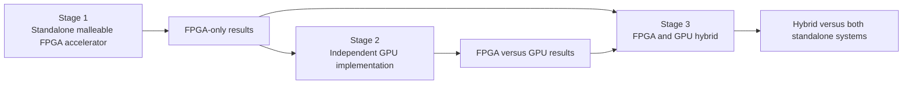
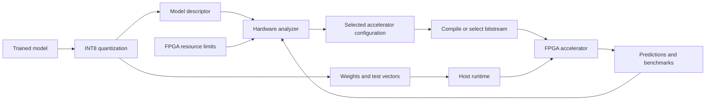
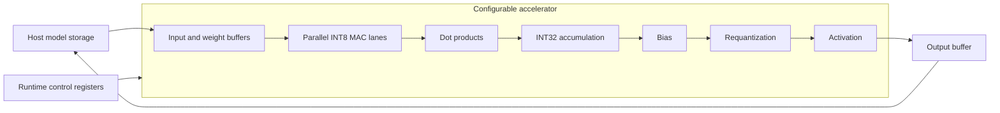

# MalleableAI-FPGA

MalleableAI-FPGA is an experiment in building an FPGA AI accelerator that can
adapt its hardware architecture to the neural network it needs to run.

Instead of forcing every model through one fixed accelerator, the long-term
system will examine a model, choose a suitable compute layout, and deploy that
layout to the FPGA. Small models might use a compact low-power design, while
larger models might use more parallel arithmetic, different buffer sizes, or a
different dataflow.

The FPGA performs inference. Model training, quantization, hardware selection,
and FPGA compilation happen on a host computer.

## What I am trying to build

The final platform should be able to:

1. Accept a trained neural network.
2. Convert it to a precise integer representation.
3. Examine the model's layer shapes and memory requirements.
4. Choose an accelerator configuration that fits the target FPGA.
5. Load a precompiled hardware personality and the model's weights.
6. Run inference and measure latency, throughput, resource use, and accuracy.
7. Compare alternative hardware configurations and learn which one works best.

On the current Cyclone V, configurations will initially be compiled as complete
FPGA designs. A future Kria or Zynq UltraScale+ platform could keep a fixed
control and memory shell while replacing only the accelerator region with a
precompiled partial bitstream.

The FPGA will not synthesize RTL by itself. It will select from hardware designs
that were generated and compiled ahead of time.

## Three-stage research roadmap

The project will be developed and evaluated in three stages. **Stage 1 is the
original project and remains unchanged.** The GPU and hybrid work are later
extensions, not requirements or design constraints for the current FPGA
accelerator.



1. **Original FPGA project:** finish the standalone, model-adaptive FPGA
   inference platform described in this repository. It must operate and produce
   complete FPGA-only results without a GPU. Its longer-term FPGA-only scope
   includes a decoder-only language model and standalone token generation.
2. **Independent GPU extension:** run a comparable model and workload entirely
   on a GPU, producing a separate GPU-only baseline. The FPGA is not involved
   in this result.
3. **Hybrid extension:** connect the two already-working systems. The intended
   first experiment uses the FPGA for candidate-token generation and the GPU
   for verification, then compares the hybrid against both standalone results.

The hybrid is considered an improvement only if measured end-to-end results
show that its benefits exceed verification and communication overhead. See
[`docs/research-roadmap.md`](docs/research-roadmap.md) for scope boundaries,
completion criteria, and comparison rules.

## System architecture



The analyzer connects the AI model to the hardware. It will explore choices such
as MAC parallelism, precision, buffer sizes, tile sizes, and dataflow.

## FPGA compute architecture



A multiply-accumulate unit, or MAC, evaluates:

```text
accumulator + input * weight
```

Neural networks repeat this operation many times. Multiple MAC lanes form dot
products; dot products form neurons and layers; layers form the complete model.
Large layers will be divided into tiles so weights and activations can move
through limited on-chip memory. Double buffering will eventually allow one tile
to compute while the next tile is transferred.

## What works today

- A parameterized signed INT8 MAC with signed INT32 accumulation
- Explicit accumulator-overflow reporting
- A parameterized parallel INT8 dot-product block
- Self-checking SystemVerilog tests
- 10,000 seeded randomized MAC cases
- 2,500 seeded randomized dot-product cases
- Cyclone V Quartus project files and 100 MHz timing constraints
- Automated RTL verification through GitHub Actions

The arithmetic has been simulated and linted. The Quartus projects still need
to be compiled on a machine with Quartus Prime Lite to record real FPGA resource
and timing results.

## Numeric contract

The first verified datapath uses:

```text
signed INT8 input x signed INT8 weight
                  + signed INT32 accumulator
                  = signed INT32 result
```

The multiplication is exact. Scaling, rounding, saturation, bias, and activation
are not hidden inside the MAC. They will be implemented as separate stages with
matching RTL and software behavior.

See `docs/numeric-contract.md` for the complete bit-level rules.

## Run the project

Requirements:

- Icarus Verilog
- Make

Run all current verification:

```sh
make test
```

With Quartus Prime Lite 25.1 installed, compile the Cyclone V projects with:

```sh
quartus_sh --flow compile quartus/int8_mac/int8_mac
quartus_sh --flow compile quartus/int8_dot_product/int8_dot_product
```

## Repository layout

```text
rtl/        SystemVerilog compute blocks
sim/        Paired self-checking RTL testbenches
quartus/    Cyclone V projects and timing constraints
docs/       Architecture, research roadmap, contributor plans, and specifications
```

The layout follows the same small-module, paired-testbench style used in the
separate Jane Street protocol-emulator project. The two projects do not share
RTL and have different architectures and goals.

## ML and software contribution

The golden model and software toolchain are intentionally unimplemented. The ML
contributor owns their design and implementation from first principles. See
`docs/ml-contributor-roadmap.md` for the required milestones, interfaces, and
acceptance criteria.

## Future goals

### Stage 1: original standalone FPGA project

- [x] Verify signed INT8 multiply-accumulate arithmetic
- [x] Build a parameterized parallel dot product
- [ ] Build an independent bit-accurate golden model
- [ ] Define the model descriptor and exported artifact formats
- [ ] Build the hardware-configuration analyzer
- [ ] Add tiled accumulation and bias handling
- [ ] Implement precisely matched requantization and ReLU stages
- [ ] Run a complete tiny neural network in RTL simulation
- [ ] Add on-chip activation and weight buffers
- [ ] Overlap memory transfers and computation with double buffering
- [ ] Run the accelerator on the Cyclone V board
- [ ] Benchmark multiple lane, buffer, tile, precision, and dataflow choices
- [ ] Add runtime-configurable control registers
- [ ] Generate several precompiled hardware personalities
- [ ] Port to a Kria or Zynq UltraScale+ platform
- [ ] Use partial reconfiguration to swap accelerator personalities while the
  surrounding system continues running
- [ ] Extend the standalone accelerator to a small decoder-only language model
- [ ] Generate tokens using FPGA inference without GPU computation

### Stage 2: independent GPU extension

- [ ] Define a controlled FPGA-versus-GPU benchmark workload
- [ ] Run the comparable model independently on a GPU
- [ ] Record GPU-only latency, throughput, memory, energy, and output quality
- [ ] Compare the standalone FPGA and GPU results

### Stage 3: FPGA and GPU hybrid extension

- [ ] Define the FPGA-to-GPU token and state-transfer interface
- [ ] Use the completed FPGA system for candidate-token generation
- [ ] Use the completed GPU system for verification
- [ ] Measure acceptance rate and communication and verification overhead
- [ ] Compare the hybrid against both standalone systems end to end

## Project status

This is early-stage research. The verified MAC and dot-product blocks form the
arithmetic foundation; the next milestone is a tiled dense layer with bias,
requantization, and activation.

## License

MIT
