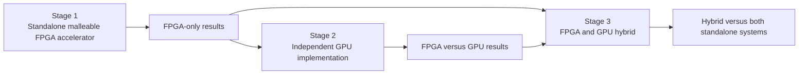
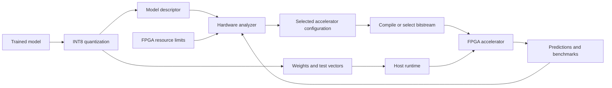
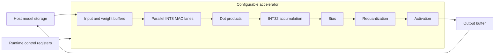

# MalleableAI-FPGA

MalleableAI-FPGA is an experiment in building an FPGA AI accelerator that can
adapt its hardware architecture to the neural network it needs to run.

Instead of forcing every model through one fixed accelerator, the long-term
system will examine a model, choose a suitable compute layout, and deploy that
layout to the FPGA. Small models might use a compact low-power design, while
larger models might use more parallel arithmetic, different buffer sizes, or a
different dataflow.

The FPGA performs inference. Model training, quantization, hardware selection,
and FPGA compilation happen on a host computer.

## What I am trying to build

The final platform should be able to:

1. Accept a trained neural network.
2. Convert it to a precise integer representation.
3. Examine the model's layer shapes and memory requirements.
4. Choose an accelerator configuration that fits the target FPGA.
5. Load a precompiled hardware personality and the model's weights.
6. Run inference and measure latency, throughput, resource use, and accuracy.
7. Compare alternative hardware configurations and learn which one works best.

On the current Cyclone V, configurations will initially be compiled as complete
FPGA designs. A future Kria or Zynq UltraScale+ platform could keep a fixed
control and memory shell while replacing only the accelerator region with a
precompiled partial bitstream.

The FPGA will not synthesize RTL by itself. It will select from hardware designs
that were generated and compiled ahead of time.

## Three-stage research roadmap

The project will be developed and evaluated in three stages. **Stage 1 is the
original project and remains unchanged.** The GPU and hybrid work are later
extensions, not requirements or design constraints for the current FPGA
accelerator.


```mermaid
flowchart LR
    S1[Stage 1<br/>Standalone malleable FPGA accelerator] --> R1[FPGA-only results]
    R1 --> S2[Stage 2<br/>Independent GPU implementation]
    S2 --> R2[FPGA versus GPU results]
    R1 --> S3[Stage 3<br/>FPGA and GPU hybrid]
    R2 --> S3
    S3 --> R3[Hybrid versus both standalone systems]
```

1. **Original FPGA project:** finish the standalone, model-adaptive FPGA
   inference platform described in this repository. It must operate and produce
   complete FPGA-only results without a GPU. Its longer-term FPGA-only scope
   includes a decoder-only language model and standalone token generation.
2. **Independent GPU extension:** run a comparable model and workload entirely
   on a GPU, producing a separate GPU-only baseline. The FPGA is not involved
   in this result.
3. **Hybrid extension:** connect the two already-working systems. The intended
   first experiment uses the FPGA for candidate-token generation and the GPU
   for verification, then compares the hybrid against both standalone results.

The hybrid is considered an improvement only if measured end-to-end results
show that its benefits exceed verification and communication overhead. See
[`docs/research-roadmap.md`](docs/research-roadmap.md) for scope boundaries,
completion criteria, and comparison rules.

## System architecture


```mermaid
flowchart LR
    Model[Trained model] --> Quantize[INT8 quantization]
    Quantize --> Descriptor[Model descriptor]
    Descriptor --> Analyzer[Hardware analyzer]
    FPGAInfo[FPGA resource limits] --> Analyzer
    Analyzer --> Choice[Selected accelerator configuration]
    Choice --> Compile[Compile or select bitstream]
    Compile --> FPGA[FPGA accelerator]
    Quantize --> Weights[Weights and test vectors]
    Weights --> Host[Host runtime]
    Host --> FPGA
    FPGA --> Results[Predictions and benchmarks]
    Results --> Analyzer
```

The analyzer connects the AI model to the hardware. It will explore choices such
as MAC parallelism, precision, buffer sizes, tile sizes, and dataflow.

## FPGA compute architecture


```mermaid
flowchart LR
    Host[Host model storage] --> InBuf[Input and weight buffers]

    subgraph Accelerator[Configurable accelerator]
        InBuf --> MACs[Parallel INT8 MAC lanes]
        MACs --> Dot[Dot products]
        Dot --> Acc[INT32 accumulation]
        Acc --> Bias[Bias]
        Bias --> Requant[Requantization]
        Requant --> Act[Activation]
    end

    Act --> OutBuf[Output buffer]
    OutBuf --> Host

    Control[Runtime control registers] --> Accelerator
```

A multiply-accumulate unit, or MAC, evaluates:

```text
accumulator + input * weight
```

Neural networks repeat this operation many times. Multiple MAC lanes form dot
products; dot products form neurons and layers; layers form the complete model.
Large layers will be divided into tiles so weights and activations can move
through limited on-chip memory. Double buffering will eventually allow one tile
to compute while the next tile is transferred.

## What works today

The active [local LLM workbench](docs/local-llm-platform.md) integrates pinned
OpenTPU, safe local Safetensors import, full-RTL/ISA backends, ordered live job
events, Lens trace replay and quality-constrained optimization interfaces.
The custom SSM path is retired (ADR-0003). Real-model acceptance and CUDA/hybrid
deployment are separately gated; no physical FPGA speed or AWS integration is
claimed. The existing INT8 dense path below remains unchanged.

- A parameterized signed INT8 MAC with signed INT32 accumulation
- Explicit accumulator-overflow reporting
- A parameterized parallel INT8 dot-product block
- Multi-tile accumulation for reductions larger than the lane count
- Per-output bias, integer requantization, INT8 saturation, and optional ReLU
- Descriptor-driven execution of up to four dense layers
- Ping-pong activation buffers and internal weight/parameter memories
- A board-independent configuration, control, status, and result interface
- Self-checking SystemVerilog tests
- 10,000 seeded randomized MAC cases
- 2,500 seeded randomized dot-product cases
- 10,000 seeded post-processing cases
- 1,000 seeded tiled reductions
- 1,000 randomized dense layers and 100 complete 7-to-5-to-3 networks
- Cyclone V Quartus project files and 100 MHz timing constraints
- Automated simulation, Verilator lint, and Yosys synthesis through GitHub Actions
- A dependency-free Python model analyzer, integer reference, SQLite experiment
  store, RTL runner, overhead-aware selector, and experimental Double DQN learner
- Separately synthesized 1/2/4/8-lane personalities, runtime active lanes, and counters

The complete dense-network MVP has been simulated, linted, and checked with
coarse Yosys synthesis. The Quartus projects still need to be extended to the
integrated top level and compiled on a machine with Quartus Prime Lite to record
real FPGA resource and timing results.

## Numeric contract

The first verified datapath uses:

```text
signed INT8 input x signed INT8 weight
                  + signed INT32 accumulator
                  = signed INT32 result
```

The multiplication is exact. Scaling, rounding, saturation, bias, and activation
are not hidden inside the MAC. They are implemented as separate stages with
matching RTL and software behavior.

See `docs/numeric-contract.md` for the complete bit-level rules.

## Run the project

Moving from the Mac to the Zephyrus? Follow the
[WSL2 setup and continuation guide](docs/zephyrus-handoff.md).

For local LLM simulation and the workbench (Node 22+, Verilator and a source checkout):

```sh
python3 -m venv .venv
.venv/bin/pip install -e '.[llm,ide,test]'
make ui
make verify-llm PYTHON=.venv/bin/python
.venv/bin/python -m malleable.ide --model-root build/models
```

Open `http://127.0.0.1:8765`. Place supported checkpoint folders inside the model
root. If you explicitly want downloads, run
`.venv/bin/python tools/download_llm_models.py --destination build/models`.
Inference itself is offline. Full RTL is slow; compilation, host execution and
RTL cycles are reported separately. See the guide for release and quality gates.

For the dependency-free dense baseline:

Requirements:

- Icarus Verilog
- Verilator
- Yosys
- Make
- Python 3.10 or newer (standard library only)

Run simulation only:

```sh
make test
```

Run simulation, lint, and synthesis:

```sh
make verify
```

Run a model-aware experiment from the repository root:

```sh
python3 -m malleable analyze --size light
python3 -m malleable benchmark --size light --requests 4
python3 -m malleable optimize --size heavy --lanes 1 --active-lanes 1 --switch-cycles 10000
python3 -m malleable train --episodes 20 --switch-cycles 10000
```

See [the model-aware system guide](docs/model-aware-system.md) for artifact
schemas, evaluation/promotion, counter definitions, and measurement limitations.
This is a simulation research system, not a physical-board deployment runtime.

With Quartus Prime Lite 25.1 installed, compile the Cyclone V projects with:

```sh
quartus_sh --flow compile quartus/int8_mac/int8_mac
quartus_sh --flow compile quartus/int8_dot_product/int8_dot_product
```

## Repository layout

```text
rtl/        SystemVerilog compute blocks
sim/        Paired self-checking RTL testbenches
quartus/    Cyclone V projects and timing constraints
docs/       Architecture, research roadmap, contributor plans, and specifications
malleable/  Python reference, host runtime, experiment storage, and learning
tests/      Host and Python-to-RTL integration regressions
```

The layout follows the same small-module, paired-testbench style used in the
separate Jane Street protocol-emulator project. The two projects do not share
RTL and have different architectures and goals.

## ML and software contribution

The independent integer reference and versioned dense artifacts now live in
`malleable/`. Framework exporters, labeled task-accuracy evaluation, and physical
board integration remain contributor opportunities. The older
`docs/ml-contributor-roadmap.md` is historical; the model-aware system guide
describes the current software interfaces.

## Local LLM release gates

The active release preserves the verified dense RTL baseline and uses pinned
OpenTPU as a separate local LLM execution backend. The service, live workbench,
fixed-tape benchmark schedule, quality approvals, optimization sessions, and
explicitly gated CUDA/hybrid commands are implemented in the current review
branch. Their presence is not a release pass.

- [ ] Complete full-RTL short-prompt + eight-token acceptance for all three
  official checkpoints and attach bit-exact state/logit evidence.
- [ ] Pass held-out quality for each selectable model/variant using frozen,
  disjoint suites with at least 1,024 validation and held-out targets.
- [ ] Complete the staged ten-run performance suite per model and base-model-
  disjoint predictor/RL evaluations with five seeds and leakage checks.
- [ ] On the Zephyrus in WSL2, capture a local Qwen3-1.7B CUDA greedy baseline,
  then a tokenizer-validated full-RTL Qwen3-0.6B draft / CUDA verifier run.
- [ ] Run strict standalone and full-release checks, finish review, and publish a
  draft PR. No automatic merge to `main`.

CUDA supports only the specified local Qwen3 verifier path; the hybrid remains
greedy-only and must match GPU-only output. These tests establish neither
physical FPGA timing/resource fit/power nor a guaranteed speedup. AWS, board
programming, partial reconfiguration, runtime personality controls, additional
architectures, model retraining and contextual-bandit extensions are excluded
from this release.

## Project status

This is early-stage research. Dense arithmetic is verified; local LLM simulations
and optimizers remain subject to the explicit acceptance gates above. Learned
policies are candidates until held-out evaluation and promotion; RL superiority
is not assumed. Physical-board timing, resource occupancy and power are not
available from simulation.

## License

MIT
