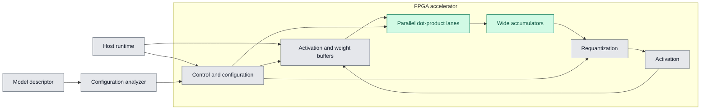

# Architecture

## System boundary

MalleableAI-FPGA is an inference research platform. A host computer prepares a
quantized model, selects an accelerator configuration, loads model data, and
collects results. The FPGA performs integer inference. It does not train models
or synthesize new hardware by itself.

This repository is independent of the Jane Street protocol-emulator project.
It adopts that project's useful development conventions—small SystemVerilog
modules, paired self-checking testbenches, reproducible Quartus projects, and
simulation in CI—without sharing RTL or combining the two architectures.

The architecture in this document is Stage 1 of the research roadmap and
remains a standalone FPGA system. A later independent GPU implementation and a
later FPGA-GPU hybrid experiment must not change the purpose or completion
criteria of this architecture. See `docs/research-roadmap.md` for the boundaries
between those stages.

## Incremental hardware architecture

The verified dot-product block accepts several independent INT8 activation and
weight pairs in one cycle. `LANES` controls the amount of parallel arithmetic.
Its INT32 input allows multiple tiles to contribute to one accumulated result.

## Intended execution sequence

1. The ML pipeline exports signed INT8 weights, representative inputs, scales,
   biases, expected outputs, and a model descriptor.
2. The analyzer inspects layer dimensions and an FPGA resource budget.
3. It chooses candidate lane counts, buffer sizes, tile shapes, and dataflow.
4. The host configures or loads the selected accelerator personality.
5. Model data is transferred in tiles; double buffering will eventually overlap
   transfer with computation.
6. FPGA results are compared with the integer reference and benchmarked.

## Stable interfaces

- **Numeric contract:** `docs/numeric-contract.md` is authoritative for types
  and overflow behavior.
- **RTL handshake:** `valid_in` marks an accepted input sample; `valid_out`
  marks its registered result one clock later.
- **Lane packing:** lane zero occupies the least-significant bits of each packed
  vector.

The model descriptor and software artifact formats are intentionally left for
the ML contributor to design. Their implementation must conform to the numeric
contract and RTL interfaces above.

## Planned growth

The next hardware layer will repeatedly feed dot-product tiles into an
accumulator, add a bias, then pass the result to an independently verified
requantization/activation stage. Memory interfaces and board-specific shells
remain outside the arithmetic modules so the same compute blocks can move from
Cyclone V to a future Zynq UltraScale+ or Kria platform.
