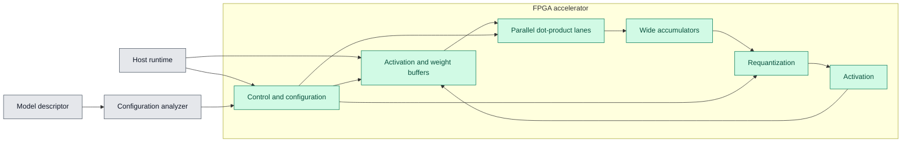

# Architecture

## System boundary

MalleableAI-FPGA is an inference research platform. A host computer prepares a
quantized model, selects an accelerator configuration, loads model data, and
collects results. The FPGA performs integer inference. It does not train models
or synthesize new hardware by itself.

This repository is independent of the Jane Street protocol-emulator project.
It adopts that project's useful development conventions—small SystemVerilog
modules, paired self-checking testbenches, reproducible Quartus projects, and
simulation in CI—without sharing RTL or combining the two architectures.

The architecture in this document is Stage 1 of the research roadmap and
remains a standalone FPGA system. A later independent GPU implementation and a
later FPGA-GPU hybrid experiment must not change the purpose or completion
criteria of this architecture. See `docs/research-roadmap.md` for the boundaries
between those stages.

## Incremental hardware architecture

```mermaid
flowchart LR
    Host[Host runtime] --> Control[Control and configuration]
    Model[Model descriptor] --> Analyzer[Configuration analyzer]
    Analyzer --> Control
    Host --> Buffers[Activation and weight buffers]

    subgraph FPGA[FPGA accelerator]
        Buffers --> Dot[Parallel dot-product lanes]
        Dot --> Acc[Wide accumulators]
        Acc --> Req[Requantization]
        Req --> Act[Activation]
        Act --> Buffers
        Control --> Buffers
        Control --> Dot
        Control --> Req
    end

    classDef verified fill:#d1fae5,stroke:#047857,color:#064e3b;
    classDef active fill:#fef3c7,stroke:#b45309,color:#78350f;
    classDef planned fill:#e5e7eb,stroke:#4b5563,color:#111827;
    class Dot,Acc,Control,Buffers,Req,Act verified;
    class Model,Analyzer,Host planned;
```

The verified dot-product block accepts several independent INT8 activation and
weight pairs in one cycle. `LANES` controls the amount of parallel arithmetic.
Its INT32 input allows multiple tiles to contribute to one accumulated result.

## Intended execution sequence

1. The ML pipeline exports signed INT8 weights, representative inputs, scales,
   biases, expected outputs, and a model descriptor.
2. The analyzer inspects layer dimensions and an FPGA resource budget.
3. It chooses candidate lane counts, buffer sizes, tile shapes, and dataflow.
4. The host configures or loads the selected accelerator personality.
5. Model data is transferred in tiles; double buffering will eventually overlap
   transfer with computation.
6. FPGA results are compared with the integer reference and benchmarked.

## Stable interfaces

- **Numeric contract:** `docs/numeric-contract.md` is authoritative for types
  and overflow behavior.
- **RTL handshake:** `valid_in` marks an accepted input sample; `valid_out`
  marks its registered result one clock later.
- **Lane packing:** lane zero occupies the least-significant bits of each packed
  vector.

The model descriptor and software artifact formats are intentionally left for
the ML contributor to design. Their implementation must conform to the numeric
contract and RTL interfaces above.

## Autonomous dense-network MVP

`malleable_accelerator_top` is the first complete inference datapath. Its
default personality supports four dense layers, dimensions up to 64 by 64, and
four parallel INT8 lanes. The host or testbench preloads descriptors, inputs,
weights, biases, multipliers, and shifts through a board-independent 32-bit
configuration port. One `start` pulse then executes every layer without host
intervention.

Each output is evaluated by feeding consecutive tiles into the verified dot-
product block. Results pass through bias addition, per-output integer
requantization, signed INT8 saturation, and optional ReLU. Two activation banks
alternate between layers, so an output layer becomes the next layer's input
without a host copy.

The top-level status contract is:

- `cfg_valid` and `cfg_ready` accept configuration writes only while idle.
- `start` begins a structurally valid, fully parameterized network.
- `busy` remains asserted for the complete network.
- `done` pulses for one cycle after the final output is stored.
- `overflow_error` records arithmetic overflow without hiding the wrapped
  result.
- `config_error` records invalid descriptors, parameters, or control requests.
- Result reads are synchronous and return one final activation per address.

The generic configuration port is intentionally not AXI or Avalon. A future
board shell will adapt it to the selected host transport without changing the
compute or numeric contracts. The caller must write every input and weight
address consumed by the descriptors before asserting `start`; descriptor and
per-output parameter completeness are checked directly by the RTL.

## Planned growth

The next hardware work is a board-specific host adapter and measured Cyclone V
implementation. The compute blocks and generic configuration interface remain
independent of the board shell so they can later move to Zynq UltraScale+ or
Kria platforms.
