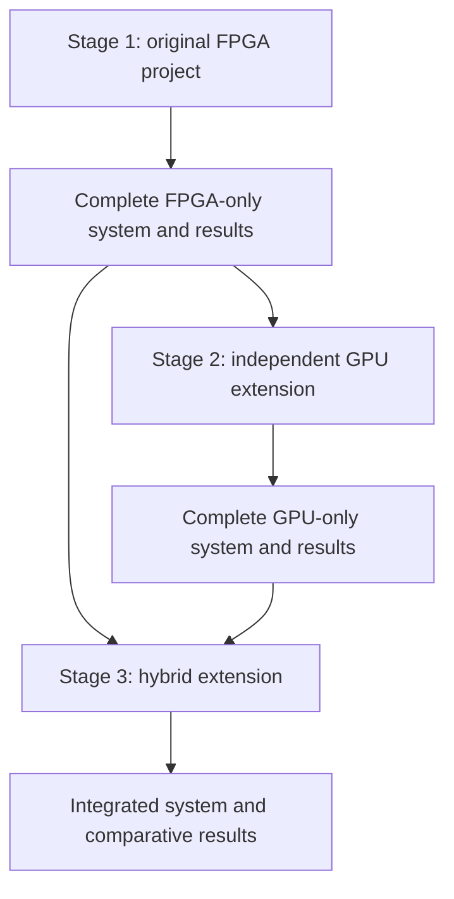
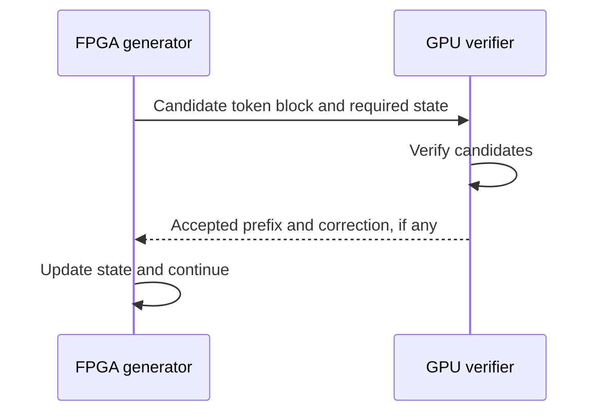

# Research Roadmap

## Purpose

The research program has three sequential stages: the original standalone FPGA
project, an independent GPU implementation, and an FPGA-GPU hybrid experiment.
Each stage must produce its own usable system and measurable result.

## Non-negotiable project boundary

Stage 1 is the original MalleableAI-FPGA project described by the README and
architecture documents. It is not being redesigned as a helper for the GPU or
as only a speculative-decoding draft engine.

The FPGA design must be completed and evaluated independently before GPU or
hybrid requirements are introduced. Later stages should connect to the
standalone design through explicit adapters and interfaces instead of changing
its original purpose.



## Stage 1: original standalone FPGA project

### Goal

Build the model-adaptive FPGA inference platform already defined by this
repository. A host may prepare models, load data, control execution, and display
results, but the FPGA performs the neural-network inference.

The verified INT8 MAC and dot-product units remain the arithmetic foundation.
Development proceeds through tiled accumulation, layer processing, buffering,
control, complete model execution, and eventually standalone decoder-only
language-model token generation.

### Required result

Stage 1 is complete only when the FPGA path can be evaluated without GPU
computation and has documented:

- Correctness against an independent reference implementation
- End-to-end inference or token-generation behavior
- Latency and throughput
- FPGA logic, memory, and DSP utilization
- Power or energy measurements when the platform exposes them
- Numeric precision and output-quality effects

This standalone result remains valuable even if Stages 2 and 3 are never
performed.

## Stage 2: independent GPU extension

### Goal

Implement and measure a GPU-only execution path after Stage 1 is working. The
GPU must produce results without receiving computation from the FPGA.

At least one comparison must use a controlled workload with the same model,
weights, tokenizer, prompts, context length, batch size, generation length, and
decoding settings. Precision differences must be recorded explicitly rather
than hidden.

### Required result

- A reproducible GPU-only inference run
- GPU latency, throughput, memory use, and available energy measurements
- Output correctness or quality measurements
- An FPGA-versus-GPU comparison using the controlled workload

## Stage 3: FPGA and GPU hybrid extension

### Goal

Connect the completed standalone systems without erasing either baseline. The
first intended architecture uses the FPGA to generate candidate tokens and the
GPU to verify them. The exact verification protocol will be specified only
after the standalone measurements reveal the useful operating points.



### Required result

- A documented FPGA-GPU protocol and state boundary
- End-to-end hybrid token generation
- Candidate acceptance rate
- FPGA generation time
- Transfer and synchronization time
- GPU verification time
- Total latency, throughput, and energy
- Direct comparison against both Stage 1 and Stage 2 results

## Comparison rules

All reported improvements must use complete end-to-end measurements. Setup,
data transfer, synchronization, verification, and rejected work cannot be
excluded merely because they make a result slower.

The primary calculations are:

```text
speedup over baseline = baseline execution time / hybrid execution time

throughput improvement (%) =
    (hybrid tokens/second / baseline tokens/second - 1) * 100

energy improvement = baseline energy/token / hybrid energy/token
```

The hybrid architecture is not assumed to be faster. Determining when it wins,
why it wins, and when communication or verification removes the benefit is part
of the research result.

## Current priority

Only Stage 1 is currently in implementation. Its next RTL milestone is a tiled
dense-layer path that adds bias, requantization, and activation above the
verified dot-product foundation. Stage 2 and Stage 3 remain documented future
extensions until the standalone FPGA system produces an end-to-end result.
